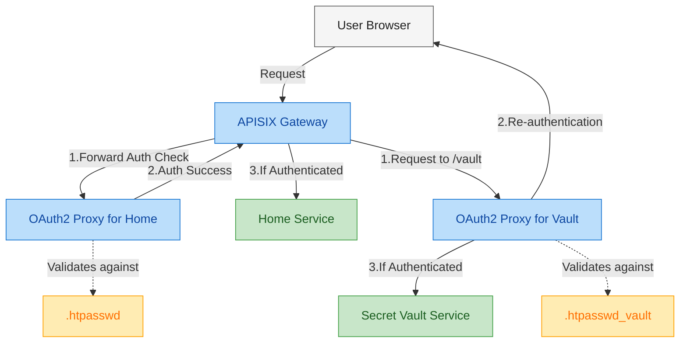

# Multi-Level Authentication with APISIX and OAuth2 Proxy

This project demonstrates implementing a multi-level authentication system using Apache APISIX as the API gateway and OAuth2 Proxy for authentication.

This is not used APISix's [Multi-Auth](https://apisix.apache.org/docs/apisix/plugins/multi-auth/) plugin, since its not support the forward auth plugin.

## Overview

### Architecture Diagram



### Authentication Concept

The system implements two levels of authentication:

1. **Single Authentication (Home Service)**:
   - Users need to authenticate once to access the home service.
   - Authentication is handled by the first OAuth2 Proxy instance.
   - Credentials: username: `admin`, password: `TopSecret`

2. **Double Authentication (Vault Service)**:
   - Access to the sensitive vault service requires re-authentication.
   - After successfully logging into the home service, users must authenticate again with different credentials.
   - The second layer is handled by a separate OAuth2 Proxy instance with its own credentials store.
   - Credentials: username: `user`, password: `TopSecret`

This multi-level authentication pattern is useful for:
- Protecting highly sensitive areas of an application
- Implementing the principle of defense in depth
- Requiring explicit consent before accessing critical resources
- Reducing the risk of session hijacking attacks

## Setup Instructions

### Prerequisites

- Docker and Docker Compose installed on your system

### Bringing Up the Stack

1. Clone this repository (or ensure you have all the configuration files in place)

2. Navigate to the project directory:
   ```bash
   cd /path/to/multiauth
   ```

3. Start the services using Docker Compose:
   ```bash
   docker compose up -d
   ```

4. Verify all services are running:
   ```bash
   docker compose ps
   ```

## Accessing the Services

### Home Service

1. Open your browser and navigate to:
   ```
   http://localhost/
   ```

2. You'll be redirected to the authentication page

3. Log in with:
   - Username: `admin`
   - Password: `TopSecret`

4. After successful authentication, you'll see the home page with a link to the vault service.

### Vault Service

1. Click the vault link from the home page or navigate directly to:
   ```
   http://localhost/vault/?rd=/vault/
   ```

2. Even though you're already logged into the home service, you'll be prompted to authenticate again with different credentials

3. Log in with:
   - Username: `user`
   - Password: `TopSecret`

4. After this second authentication, you'll gain access to the vault service.

## Implementation Details

- **APISIX**: Acts as the API gateway, routing requests and implementing forward authentication
- **OAuth2 Proxy**: Provides the authentication layer with custom login templates
- **Forward Auth Plugin**: APISIX uses this plugin to delegate authentication to OAuth2 Proxy
- **Separate Credential Stores**: Different .htpasswd files for the two authentication layers

## File Structure

- `.htpasswd`: Credentials for the home service
- `.htpasswd_vault`: Credentials for the vault service
- `apisix.yaml`: APISIX routes and service configuration
- `config.yaml`: APISIX global configuration
- `docker-compose.yml`: Service definitions for the stack
- `templates/`: Custom OAuth2 Proxy templates

## Troubleshooting

- If you encounter authentication issues, check that the `.htpasswd` files have the correct permissions.
- Verify the cookie settings in the OAuth2 Proxy configurations if sessions aren't persisting correctly.
- For login issues, check the browser's developer tools for cookie and redirect problems.

## Security Considerations

This is a demonstration setup. For production use, consider:
- Using HTTPS for all communications
- Implementing proper cookie security
- Setting appropriate session timeouts
- Using a proper OAuth2 provider instead of htpasswd authentication


## Author

<p align="center">
  <a href="https://x.com/arulrajnet">
    
  </a>
  <br>
  <strong>Arul</strong>
  <br>
  <a href="https://x.com/arulrajnet">
    
  </a>
  <a href="https://github.com/arulrajnet">
    
  </a>
</p>
